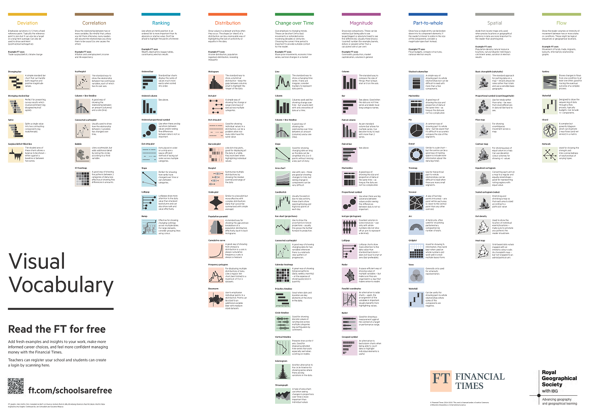

# What is Data Visualization

# What is data visualization?

Stephen Few defines data visualization as "all types of visual representations that support the exploration, examination, and communication of data" in his book __[Now You See It: Simple Visualization Techniques for Quantitative Analysis](https://olc1.ohiolink.edu/record=b27686243)__. Visualized data can help us efficiently and effectively summarize data. It can also help you observe patterns you might miss if you examined the raw data alone (e.g., __[Anscombe’s Quartet](https://en.wikipedia.org/wiki/Anscombe%27s_quartet)__). 

<!-- 

    <iframe width="560" height="315" src="https://www.youtube.com/embed/YDT5ZPcMZWM" frameborder="0" allow="accelerometer; autoplay; clipboard-write; encrypted-media; gyroscope; picture-in-picture" allowfullscreen></iframe>

 -->

:::{iframe} https://www.youtube.com/embed/YDT5ZPcMZWM
:width: 100%

:::

# Why visualize data?

Visualized data can help us ...
- **spot trends**
- **identify patterns**, and
- **quickly make sense** of our data. 

It can also help us share our data in meaninful and effective ways.

+++

# How should I visualize data?

## Know your audience
Think about the purpose of your visualization. Are you explaining or exploring a phenomenon? Will your audience better understand and respond to a simple representation of data, or something more complex? 
## Apply visual best practices:
### Choose the right chart for your data and the purpose of the visualization.
This is one of the most difficult and rewarding aspects of visualizing data. Fortunately, a small number of graphs, when skillfully formatted and presented, fulfill most data visualization needs.

The __[Financial Times Visual Vocabulary](https://ft-interactive.github.io/visual-vocabulary/)__ groups charts into various categories, such as deviation, ranking, distribution, and magnitude, to help you match your data to the relationship that is most important to visualize.  

To help you display relationships, comparisons, compositions, or distributions, __[Abela's Chart Chooser](https://extremepresentation.typepad.com/files/choosing-a-good-chart-09.pdf)__ directs you to various charts based on the number of dimensions -- or categories -- and/or the number of measures or vairable -- you have to visualize.

If you are thinking about how to influence action using the data you've collected, Stephanie Evergreen's Quantitative Chart Chooser, __[Effective Data Visualization: the Right Chart for the Right Data](https://library.ohio-state.edu/record=b10327021~S7)__ helps you to select a chart based on what you're trying to accomplish with your visualization. Published on the inside front cover of her book, the chooser guides your chart selection choices, challenging you to ask yourself whether you are trying to emphasize one number, show change over time, or display how your organization compares to a benchmark. Evergreen also provides a Qualitative Chart Chooser on the inside back cover and dedicates an entire chapter to helping you determine how to best present this data.

### Limit colors and fonts. Less is better.
Use a color selection tool to choose an accessible palette. Simplify your chart. Remove tick marks and grid lines that do not add value. Try placing labels directly on your graph, rather than in a separate key. Use color to emphasize key points.

## Add interactivity, if appropriate
Consider using Tableau, RShiny, or another tool to allow users to meaningfully filter your visuals. Structure filters to allow users to filter data from higher to lower levels of granularity or detail.

## Provide context, and incorporate instructions
Don't assume your audience will intuitively know how to use filters or interpret your graph. Provide context for your data source. Incorporate instructions into your title or create help page and link to it. Don't keep your audience guessing. Use your chart title to share the key takeaway(s).

## Test, test, test
Ask a trusted friend or colleague to critique your visual. Do they understand it? If your visualization is interactive, are the filters working as you intended them to?