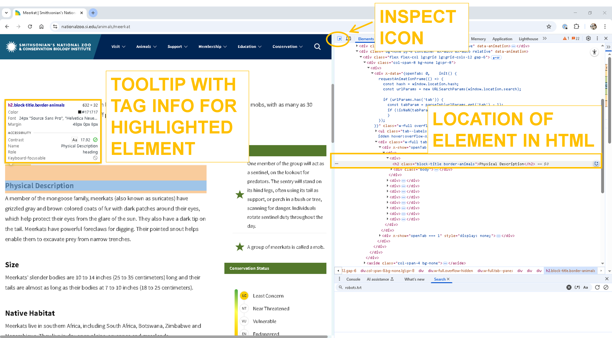
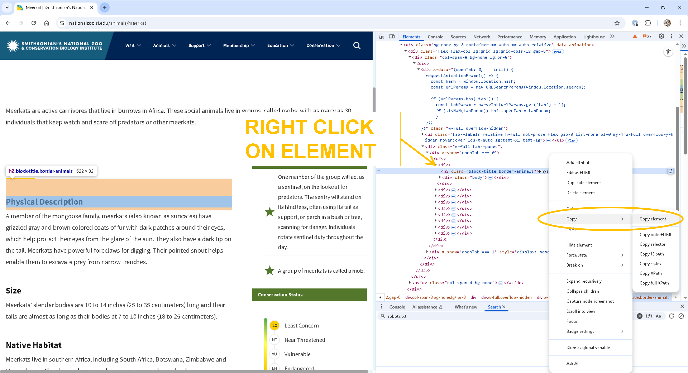
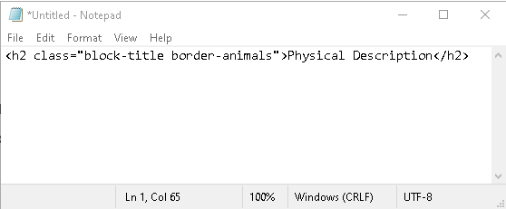

This lesson continues to explore the diverse features of BeautifulSoup, a Python library designed for parsing XML and HTML documents. We will utilize BeautifulSoup to extract information about a select group of animals showcased on the __[Meet the Animals](https://nationalzoo.si.edu/animals)__ webpage of Smithsonian's National Zoo and Conservation Biology Institute. Additionally, we will explore Pandas, a powerful Python library used to structuring, analyzing, and manipulating data.

## Data skills | concepts
- Search parameters
- HTML
- Web scraping
- Pandas data structures

## Learning objectives
1. Identify search parameters and understand how they are inserted into a url.
2. Navigate document nodes, element noes, attribute nodes, and text nodes in a Document Object Model (DOM).
3. Extract and store HTML elements
4. Export data to .csv

This tutorial assumes you already have a basic understanding of Python, including how to iterate through lists and dictionaries to extract data using a for loop. To learn basic Python concepts visit the Python - Mastering the Basics tutorial.

# LESSON 2

# Step 1. Copyright | Terms of Use
Before starting any webscraping or API project, you must 

## Review and understand the terms of use.

o	Do the terms of service include any restrictions or guidelines?

o	Are permissions/licenses needed to scrape data? If yes, have you obtained these permissions/licenses?

o	Is the information publicly available?

o	If a database, is the database protected by copyright? Or in the public domain?

## Fair Use 
Limited use of copyrighted materials is allowed under certain conditions for journalism, scholarship, and teaching. [Use the Resources for determining fair use](https://library.osu.edu/copyright/fair-use) to verify your project is within the scope of fair use. Contact University Libraries [Copyright Services](https://library.osu.edu/copyright) if you have any questions.

## Check for robots.txt directives
robots.txt directives limit web-scraping or web-crawling. Look for this file in the root directory of the website by adding /robots.txt to the end of the url. Respect these directives.

:::{admonition} Exercise 1: Examine Copyright | Terms of Use
:class: sidebar note
:icon: False

Locate and read the terms of use for the __[Smithsonian's National Zoo & Conservation Biology Institute](https://nationalzoo.si.edu/)__
1. What are the copyright restrictions for this resource? 
2. What are the terms of use?
:::

:::{seealso} Solution
:class: dropdown

The copyright restrictions for the __[Smithsonian's National Zoo & Conservation Biology Institute](https://nationalzoo.si.edu/)__ are listed with the __[Terms of Use](https://www.si.edu/termsofuse)__ and can be found on the center of the bottom footer of the webpage.

:::

# Step 2. Is an API available?
Technically yes. See __[Smithsonian Institution Open Access API documentation](https://edan.si.edu/openaccess/apidocs/#api)__ We will scrape a small sample of __[Meet the Animals](https://nationalzoo.si.edu/animals)__ HTML, however, to learn how to navigate, extract, and store HTML elements.

# Step 3. Examine the URL

:::{admonition} Exercise 2: Examine the URL
:class: sidebar note
:icon: False
Go to __[Meet the Animals](https://nationalzoo.si.edu/animals/list)__ and choose an animal to examine from the list. Note the structure of the URL. Return to __[Meet the Animals](https://nationalzoo.si.edu/animals/list)__ and select another animal to examine. Confirm the structure of the URL.
:::

:::{seealso} Solution
:class: dropdown

The base URL for the __[Meet the Animals](https://nationalzoo.si.edu/animals/list)__ webpage is https://nationalzoo.si.edu/animals/list. Note the URL ends with the word `list`. If meerkat is chosen, the __[Meet the Animals](https://nationalzoo.si.edu/animals/meerkat)__ URL changes to https://nationalzoo.si.edu/animals/meerkat. The URL now ends with `meerkat` the name of the animal.

:::

# Step 4. Inspect the elements

XML and HTML are tree-structured documents. When you request a search URL, it retrieves an HTML or XML page from a server. The browser then downloads the page into local memory and parses the HTML or XML for display. The XML we worked with in Lesson 1 was well structured and relatively simple to navigate.

- Each article was uniquely identified by the `<LogicalSectionID>` tag.
- The title for each article appeared in the  `<LogicalSectionTitle>` tag.
- The category type was included in the  `<LogicalSectionType>` tag.


## Developer Tools
HTML responses are often less clear but can be navigated with the help of Google's [Developer Tools](https://developer.chrome.com/docs/devtools/dom). To find the common name for `meerkat` I can visit the __[meerkat](https://nationalzoo.si.edu/animals/meerkat)__ webpage in Chrome, right-click on the search results and select "Inspect" to explore the DOM elements.


This action opens Google's Developer Tools on the right side of the screen. **Note**  that the default tab, "Elements," displays the HTML elements for the webpage. Scroll down to see more text on the screen. Then click the inspect icon in the Developer Tools  and  hover over an HTML element on the webpage. 

**Note** the Developer Tools highlight where the element is located in the HTML and provide a tooltip with additional information about the element.   

To view more details about the element's location in the DOM structure, right-click on the element in the Developer Tools, select `Copy > Copy element`, and then paste the text into Notepad or a similar text editor.

  





:::{admonition} Exercise 3: Inspect the Elements
:class: sidebar note
:icon: False
Go to __[Meet the Animals](https://nationalzoo.si.edu/animals/list)__ and choose an animal to examine from the list. Inspect the following elements, select `Copy > Copy element`, and then past the text to Notepad or a similar text editor.

- Common name
- Scientific name
- Taxonomic information
     - Class
     - Order
     - Family
     - Genus and species
- Physical description
- Size
- Native habitat
- Conservation status
- Fun facts
:::


# Step 5. Identify Python libraries for project
## [requests](https://requests.readthedocs.io/en/latest/)
The [requests](https://requests.readthedocs.io/en/latest/) library retrieves HTML or XML documents from a server and processes the response. 

## [BeautifulSoup](https://beautiful-soup-4.readthedocs.io/en/latest/)

[BeautifulSoup](https://beautiful-soup-4.readthedocs.io/en/latest/) parses HTML and XML documents, helping you search for and extract elements from the DOM. 

## [pandas](https://pandas.pydata.org/docs/user_guide/index.html)
Pandas is a large Python library used for manipulating and analyzing tabular data. Helpful Pandas methods include:

### [.DataFrame([data, index, columns, dtype, copy])](https://pandas.pydata.org/docs/reference/frame.html)
Constructs a DataFrame. Reference .DataFrame documentation for additional attributes.

### [.read_csv( )](https://pandas.pydata.org/docs/reference/api/pandas.Series.to_list.html)
Reads a .csv file into a Pandas DataFrame

`pd.read_csv('INSERT FILEPATH HERE')`

```{code-cell} python
import pandas as pd
df=pd.read_csv('data/meet_the_animals.csv')  #df is a common abbreviation for DataFrame
df
```

### [.tolist( )](https://pandas.pydata.org/docs/reference/api/pandas.Series.to_list.html)
Converts a column in a pandas DataFrame to a list.

`df.Series.tolist()`

```{code-cell} python
import pandas as pd
df=pd.read_csv('data/meet_the_animals.csv')
animals=df.animal.tolist()
animals
```

### [.dropna( )](https://pandas.pydata.org/docs/reference/api/pandas.DataFrame.dropna.html)

Drops `NaN` or Null values. Use carefully. If you do not specify an axis (rows=0, columns=1) or a subset of columns, pandas will drop all of the columns and rows with `NaN` values in your DataFrame. Consider assigning a new variable name to your DataFrame before using this method.

`DataFrame.dropna(*, axis=0, how=<no_default>, thresh=<no_default>, subset=None, inplace=False, ignore_index=False)`

### [.fillna( )](https://pandas.pydata.org/docs/reference/api/pandas.Series.fillna.html#pandas.Series.fillna)

Replaces `NaN` values with a value you specify.

`df.Series.fillna(value=None, *, method=None, axis=None, inplace=False, limit=None, downcast=<no_default>)`

### [.iterrows( )](https://pandas.pydata.org/docs/reference/api/pandas.DataFrame.iterrows.html#pandas.DataFrame.iterrows)

Iterates over DataFrame rows as (index, Series) pairs.

`DataFrame.iterrows()`

```{code-cell} python
import pandas as pd
df=pd.read_csv('data/meet_the_animals.csv')
for idx, row in df.iterrows():
    print(row.animal)
```

### [.iloc](https://pandas.pydata.org/docs/reference/api/pandas.DataFrame.iterrows.html#pandas.DataFrame.iterrows)

Selects row index

`DataFrame.iloc[start:end]`

```{code-cell} python
import pandas as pd
df=pd.read_csv('data/meet_the_animals.csv')
for idx, row in df.iloc[0:1].iterrows():
    print(row.animal)
```

#### [.concat( )](https://pandas.pydata.org/docs/reference/api/pandas.concat.html#pandas.concat)

Use to join DataFrames along a particular axis (rows=0, columns=1)

`pandas.concat(objs, *, axis=0, join='outer', ignore_index=False, keys=None, levels=None, names=None, verify_integrity=False, sort=False, copy=None)`

```{code-cell} python
import pandas as pd

results=pd.DataFrame(columns=['common_name','size'])
df=pd.read_csv('data/meet_the_animals.csv')
for idx, row in df.iterrows():
    common_name=row.animal
    size=10
    data_row={
        'common_name':common_name,
        'size':size     
    }
    data=pd.DataFrame(data_row, index=[0])
    results=pd.concat([data, results], axis=0, ignore_index=True)

results
```

# BONUS: try/except

Sometimes, despite your best efforts, your code will fail to execute. A tag might be missing from a webpage, or data might be entered inconsistently. **try:** and **except:** tells Python how to handle errors during the execution of your program. If an error occurs in the try block, Python will jump to the except block and then continue to execute your program.

```{code-cell} python
import pandas as pd

results=pd.DataFrame(columns=['common_name','size'])
for idx, row in df.iterrows():
    try:
        common_name=row.animal
        size=10
        data_row={
            'common_name':common_name,
            'size':size     
        }
        data=pd.DataFrame(data_row, index=[0])
        results=pd.concat([data, results], axis=0, ignore_index=True)
    except:
        common_name='no name found'
        size=0
        data_row={
                    'common_name':common_name,
                    'size':size     
                }
        data=pd.DataFrame(data_row, index=[0])
        results=pd.concat([data, results], axis=0, ignore_index=True)

results
```
:::{tip} Tip - Copilot
\
For a more detailed explanation with examples, ask Copilot to `explain try except python`.
:::

# Step 6. Write and test code
:::{admonition} Exercise 3: Meet the Animals
:class: sidebar note
:icon: False
Use pandas to read the `meet_the_animals.csv` file into a DataFrame and create a list of animal common_names. Then iterate through the list of common_names to gather the following elements from the webpages for each animal. Store the values for each variable in a Pandas DataFrame. Export DataFrame to .csv.

- Common name
- Scientific name
- Taxonomic information
     - Class
     - Order
     - Family
     - Genus and species
- Physical description
- Size
- Native habitat
- Conservation status
- Fun facts
:::


::::{seealso} Solution
:class: dropdown

```{code-cell} python
import requests
from bs4 import BeautifulSoup
import pandas as pd

#1. Read in data/meet_the_animals.csv and create a list of animals to search
df = pd.read_csv('data/meet_the_animals.csv')
animals = df.animal.tolist()

# 2. Create a DataFrame for the search results
results = pd.DataFrame(columns=['common_name', 'scientific_name', 'class',
                                'order', 'family', 'genus_species', 'physical_description',
                                'size', 'native_habitat', 'status', 'fun_facts'])

# 3. Identify the base url
base_url = 'https://nationalzoo.si.edu/animals/'

# 4. Iterate through the list of animals. Construct a url for each animal's
# website. Create a dictionary to store variables for each animal
# Then request and parse the HTML for each website, extract the variables and
# store variables in dictionary. 

count = 1
for animal in animals:
    print(f"Starting #{count} {animal}")
    count += 1
    row={} #dictionary to store variables for each animal
    url=base_url+animal
    response=requests.get(url).text
    soup=BeautifulSoup(response, 'html.parser')
    common_name=animal
    scientific_name = soup.h3.text
    row['common_name']=common_name
    row['scientific_name']=scientific_name
    block_titles=soup.find_all('h2',{'class':'block-title'})
    # # find_taxonomic_information=soup.find_all('div',{'class':'views-element-container'})
    for each_tag in block_titles:
        # print(each_tag.text)
        if each_tag.text == 'Taxonomic Information':
            # print(each_tag.text)
            biological_classifications=each_tag.find_all_next('span',{'class':'italic'})
            biological_class=biological_classifications[0].text  #named this biological_class because class alone is reserved word in Python
            biological_order=biological_classifications[1].text
            biological_family=biological_classifications[2].text
            biological_genus=biological_classifications[3].text
            row['class']=biological_class
            row['order']=biological_order
            row['family']=biological_family
            row['genus_species']=biological_genus
        elif each_tag.text == 'Physical Description':
            physical_description=each_tag.find_next('div',{'class':'body'}).text.strip()
            row['physical_description']=physical_description
        elif each_tag.text == 'Size':
            size=each_tag.find_next('div',{'class':'body'}).text.strip()
            row['size']=size
        elif each_tag.text == 'Native Habitat':
            habitat=each_tag.find_next('div',{'class':'body'}).text.strip()
            row['native_habitat']=habitat
        elif each_tag.text == 'Conservation Status':  
            status=each_tag.find_next('ul')['data-designation']
            row['stats']=status
        elif each_tag.text == 'Fun Facts':  
            facts=[]
            facts_list=each_tag.find_next('ol').find_all('li')
            for each_fact in facts_list:
                facts.append(each_fact.text)
            facts=(' ').join(facts)
            row['fun_facts']=facts
            
    each_row=pd.DataFrame(row, index=[0])
    
    #5. Concatenate each row to results.
    results=pd.concat([each_row, results], axis=0, ignore_index=True)

#6. Write results to csv    
results.to_csv('data/animals.csv') 
```

::::
