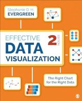
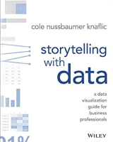

Don't discount Excel! If you have fewer than 1,000 rows of data, Excel may be the perfect tool for the job. The following resources offer insights and valuable instruction for creating impactful visualizations with Excel.

## Books

::::{grid} 1 1 2 3

:::{card}
:header: Data Visualization in Excel
 
+++
Jonathan Schwabish shows Excel remains a powerful tool for visualizing data in __[Data Visualization: A Guide for Scholars, Researchers, and Wonks](https://library.ohio-state.edu/record=b10753110~S7)__, . Each chapter provides detailed instructions for creating nearly 30 additional graphs beyond Excel’s default graph library. From the basic heatmaps to advanced Marimekko charts, this book will guide you in crafting more colorful, effective data visualizations for your audience.  
:::

:::{card}
:header: Effective Data Visualization

+++
Stephanie Evergreen’s __[Effective Data Visualization: the Right Chart for the Right Data](https://library.ohio-state.edu/record=b10327021~S7)__ provides detailed instructions for constructing and then formatting Excel graphs that inspire conversations and support decision-making. A fun ninja rating scale helps you to decide how challenging it may be to create each graph and is embedded in the side-margins of each chapter. Further, an entire chapter offers ideas for visualizing qualitative and quantitative data.  
Write MyST Markdown to create enriched documents with publication-quality features.
:::

:::{card}
:header: Storytelling with Data

+++
Cole Nussbaumer Knaflic's __[Storytelling with Data: A Data Visualization Guide for Business Professionals](https://library.ohio-state.edu/record=b7927102~S7)__ is designed to help you master communicating with data. Paired with its companion book __[Storytelling with data : let's Pratice!](https://library.ohio-state.edu/record=b8828605~S7)__, Knaflic pushes you to make your graphs clear, concise, and actionable, all while focusing on the needs of your audience.
:::
::::

