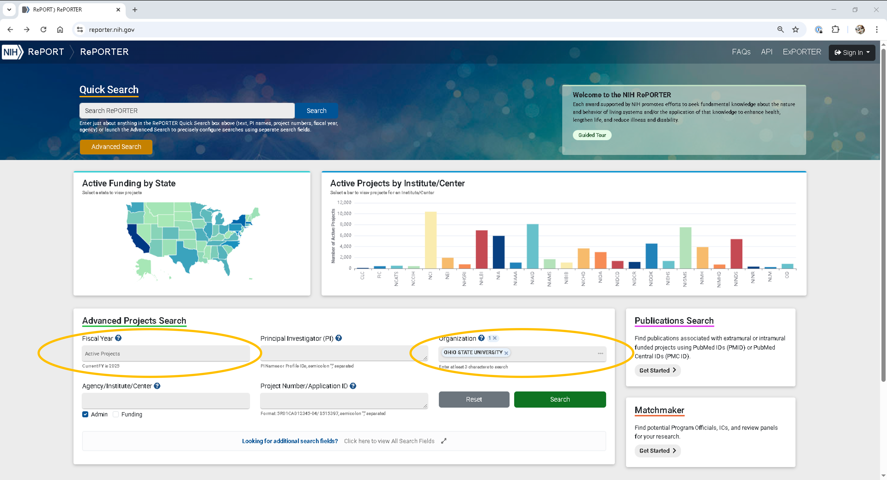
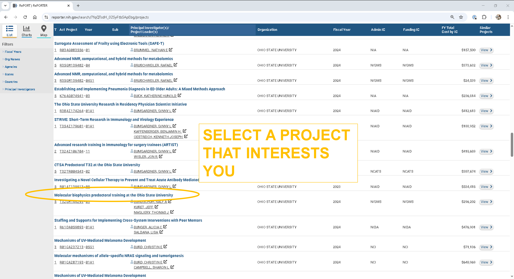
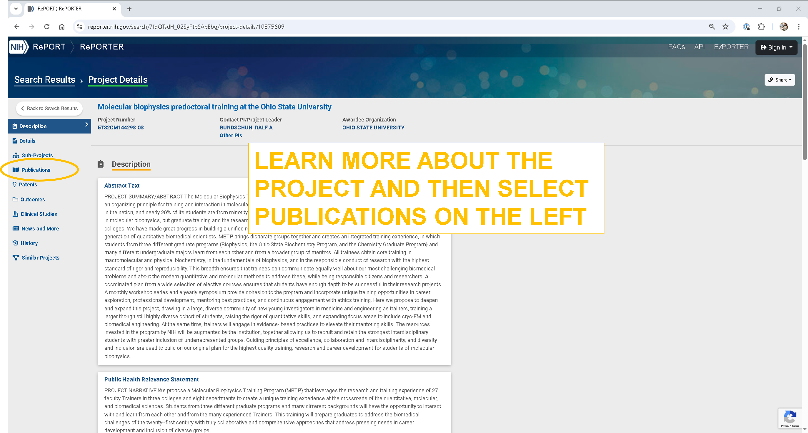
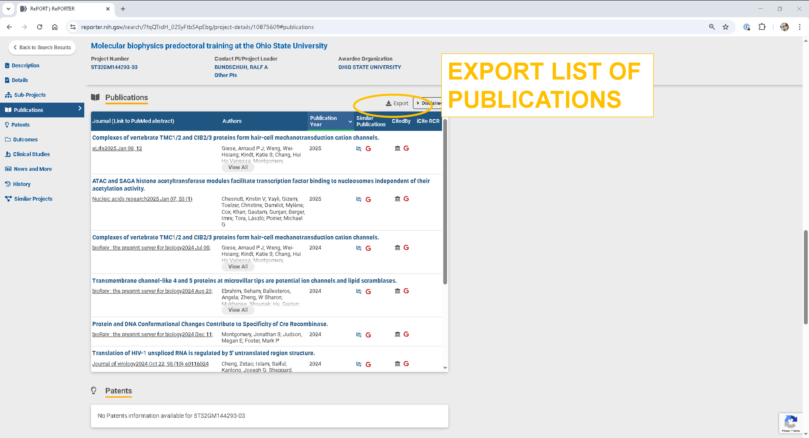

The __[Relative Citation Ratio](https://doi.org/10.1371/journal.pbio.1002541)__ (RCR) measures the influence of a scientific article by examining its co-citation network. The value benchmarks an article against the median value of 1.0 which represents the typical citation rate for articles in a field. A value above 1.0 indicates an article is cited more frequently than the  median, indicating the article may have higher influence or impact in the field. We will start by using the NIH Reporter to find an active project of a Ohio State University researcher with publications.  We will then use the __[iCite](https://icite.od.nih.gov/)__ API to find the RCR values of these publications.

## Data skills | concepts
- Working with APIs

## Learning objectives
1. Locate API documentation and identify key components required to formulate an API request
2. Parse the API response and store extracted data.

This tutorial assumes you already have a basic understanding of Python, including how to iterate through lists and dictionaries to extract data using a for loop. To learn basic Python concepts visit the Python - Mastering the Basics tutorial.

# LESSON 4

The __[NIH Reporter](https://reporter.nih.gov/)__ is a database of NIH-funded research projects that provides information about grants, contracts, publications, patents, and other outcomes resulting from NIH funding. 

**Step 1**\
To find an active NIH funded research project at The Ohio State University, under **Fiscal Year** select `Active Projects` and under **Organization** search for and select `Ohio State University`.



**Step 2**\
As of May 6, 2025 there are 687 active Ohio State University projects listed in the database. Now find a project that interests you and click on the project link.



**Step 3**\
Read the project abstract then see if any publications are currently linked to the project by clicking on publications in the left menu or scrolling to the bottom of the page.



**Step 4**\
Export the list of publications.


\


:::{admonition} Exercise 1: Read .csv
:class: sidebar note
:icon: False

Use Pandas to read the list of publications you exported into Python.

```{tip}
Move the file from downloads to your project folder
```
:::

:::{seealso} Solution
:class: dropdown

```{code-cell}
import pandas as pd
df=pd.read_csv('data/Publications_10875609_6May2025_171210.csv') #Change the path to your downloaded file

```
:::

Every article indexed in __[PubMed](https://pubmed.ncbi.nlm.nih.gov/)__ is assigned a unique PMID (PubMed Identifier). If you check the headers of the file you imported in Exercise 1, you will find PMID, meaning there is a PMID for each article in this dataset.

```{code-cell}
df.columns.tolist()
```

:::{admonition} Exercise 2: List PMIDs
:class: sidebar note
:icon: False

Create a list of PMIDs found in the PMID column. Remove nulls and convert each PMID from a float to an integer and then a string.

:::

:::{seealso} Solution
:class: dropdown

```{code-cell}
import pandas as pd
df=pd.read_csv('data/Publications_10875609_6May2025_171210.csv') 
pmid_list=df.PMID.dropna().tolist()
pmids=[]
for pmid in pmid_list:
  pmids.append(str(int(pmid)))
pmids

```
:::


:::{admonition} Exercise 3: iCite API
:class: sidebar note
:icon: False

__[Launch iCite](https://icite.od.nih.gov/analysis)__ and review the *Web Policies and Notices* and *Bulk Data and APIs* links at the bottom of the page. Find the code example for Python on the *Bulk Data and APIs* webpage.

:::

:::{seealso} Solution
:class: dropdown

```{code-block}
import requests


response = requests.get(
    "/".join([
        "https://icite.od.nih.gov/api",
        "pubs",
        "23456789",
    ]),
)
pub = response.json()
print(pub)
```

:::

:::{admonition} Exercise 4: Adjust code
:class: sidebar note
:icon: False

The Python code example provided on the *Bulk Data and APIs* webpage uses the following statement to assemble the url:
```{code-block}
    "/".join([
        "https://icite.od.nih.gov/api",
        "pubs",
        "23456789",
    ]),
```

Adjust the code to extract the following fields for each PMID.
- pmid
- doi
- journal
- relative citation ratio
- cited by
- references
- title
- year


:::

:::{seealso} Solution
:class: dropdown

```{code-block}
import pandas as pd
import requests

results=pd.DataFrame(columns=['pmid','doi','journal','rcr','cited_by','references','title','year'])

df=pd.read_csv('Publications_10875609_6May2025_171210.csv') 
pmid_list=df.PMID.dropna().tolist()
pmids=[]
for pmid in pmid_list:
  pmids.append(str(int(pmid)))

count=1
for each_pmid in pmids:
    print(f"Starting record {count}: {each_pmid}")
    response = requests.get(
        "/".join([
        "https://icite.od.nih.gov/api",
        "pubs",
        each_pmid,
        ]),
        )   
    pub = response.json()
    citing_pmids=pub['cited_by']
    cited_by=[]
    for each_citation in citing_pmids:
        cited_by.append(str(each_citation))
    reference_pmids=pub['references']
    references=[]
    for each_reference in references:
        references.append(str(each_reference))

    row = {
            'pmid': pub['pmid'],
            'doi': pub['doi'],
            'journal': pub['journal'],
            'rcr': pub['relative_citation_ratio'],
            'cited_by': ','.join(cited_by),
            'references': ','.join(references),
            'title': pub['title'],
            'year': pub['year']
            }
    each_row=pd.DataFrame(row, index=[0])
    results=pd.concat([each_row, results], axis=0, ignore_index=True)
    count += 1
```

:::


