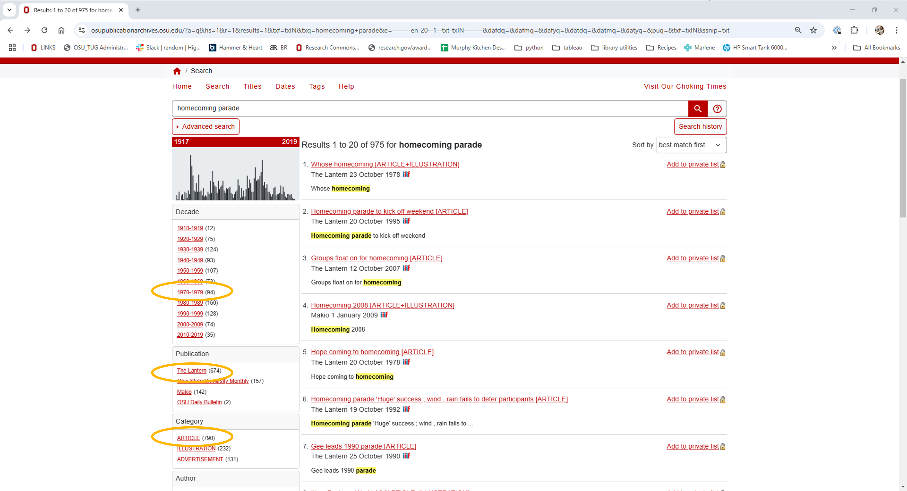
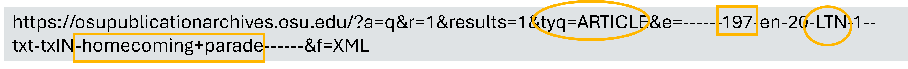
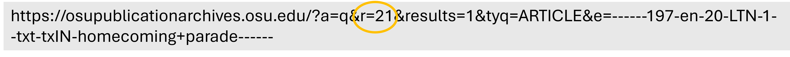
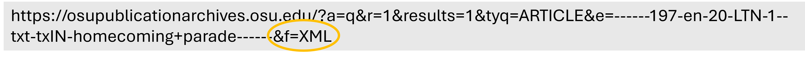
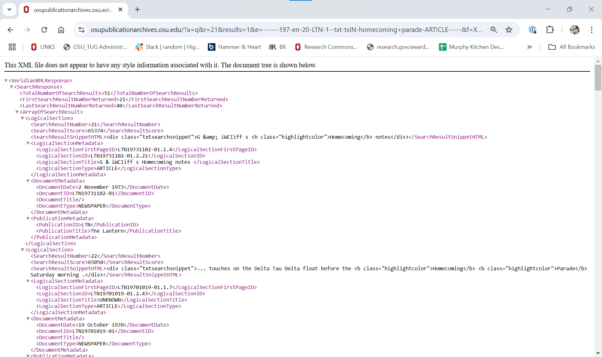

Web scraping and APIs are popular methods for collecting data from websites. **Webscraping** involves directly parsing a website's HTML, allowing extraction of a wide range of data available on a page. Webscraping, however, introduces complexity to a project, especially if the website's data is not consistently structured. **APIs** provide structured data and detailed documentation for querying the website and filtering results. They are generally easier to use but may come with restrictions, such as limits on the number of requests per day or the number of records you can retrieve. 

In publication since 1881, [***The Lantern***](https://www.thelantern.com/) is The Ohio State University's award-winning student newspaper. [***The Lantern Digital Archives***](https://osupublicationarchives.osu.edu/) includes all articles, illustrations, and advertisments published in *The Lantern* between 1881 and 2018. 

:::{important} Important
The online archive of Ohio State University's student newspaper ***The Lantern*** is accessible for research and educational purposes only. **Copyright** and other restrictions may apply. Users must obtain the necessary permissions to reprint, reproduce, or otherwise use this material.
:::

This lesson introduces BeautifulSoup, a Python library used to parse XML and HTML documents. We will use BeautifulSoup to extract elements from ***The Lantern's*** XML.

## Data skills | concepts
- Search parameters
- XML
- Web scraping

## Learning objectives
1. Identify search parameters and understand how they are inserted into a url.
2. Navigate document nodes, element noes, attribute nodes, and text nodes in a Document Object Model (DOM).
3. Extract and store XML elements.
<!-- 3. Utilize Google's Developer Tools to inspect and navigate DOM elements. -->

This tutorial assumes you already have a basic understanding of Python, including how to iterate through lists and dictionaries to extract data using a for loop. To learn basic Python concepts see Python - Mastering the Basics tutorial.

# LESSON 1

# Step 1. Copyright | Terms of Use
Before starting any webscraping or API project, you must 

## Review and understand the terms of use.

o	Do the terms of service include any restrictions or guidelines?

o	Are permissions/licenses needed to scrape data? If yes, have you obtained these permissions/licenses?

o	Is the information publicly available?

o	If a database, is the database protected by copyright? Or in the public domain?

## Fair Use 
Limited use of copyrighted materials is allowed under certain conditions for journalism, scholarship, and teaching. [Use the Resources for determining fair use](https://library.osu.edu/copyright/fair-use) to verify your project is within the scope of fair use. Contact University Libraries [Copyright Services](https://library.osu.edu/copyright) if you have any questions.

## Check for robots.txt directives
robots.txt directives limit web-scraping or web-crawling. Look for this file in the root directory of the website by adding /robots.txt to the end of the url. Respect these directives.

```{admonition} Exercise 1: Examine Copyright | Terms of Use
:class: sidebar note
:icon: False
1. Go to the [OSU Publication Archives website](https://osupublicationarchives.osu.edu/). 
2. Where is the Copyright Notice for this resource? 
3. What are the terms of use?
```
:::{seealso} Solution
:class: dropdown

The Copyright Notice for The Ohio State University's online archive of The Lantern student newspaper can be found on the bottom right of the [OSU Publication Archives website](https://osupublicationarchives.osu.edu/). The [Terms of use](https://osupublicationarchives.osu.edu/?a=p&p=terms&e=-------en-20--1--txt-txIN-------#all) are listed separately at the bottom left.

:::
**Note** The Ohio State University provides the online archives of Ohio State's student newspaper *The Lantern*, the student yearbook *The Makio*, and alumni magazines for research and educational purposes only. The Terms of use specify that unauthorized **mass** downloading or scraping into any format is prohibited. For this lesson, please limit your search results to scrape no more than 100 records.

# Step 2. Is an API available?
APIs can simplify data collection from a website by returning structured data such as JSON or XML. Examples of APIs include:

- [PubMed eUtilities](https://www.ncbi.nlm.nih.gov/books/NBK25500/)
- [Elsevier APIs](https://dev.elsevier.com/)
- [Spotify Web API](https://developer.spotify.com/documentation/web-api)

To determine is an API is available, try searching for the name of the website and "API" or "documentation." If an API is available, read the terms of use and consider factors like rate limits, costs, and access restrictions. 

If an API is not available, that's okay. Data collection might be a bit more complex, but always remember to respect copyright and terms of use.

:::{tip} 
The [OSU Publication Archives website](https://osupublicationarchives.osu.edu/) is powered by Veridian software, enabling full-text searching of the Libraries digital collections possible. To output a search results from The Lantern to XML, simply add `&f=XML` to the end of your url. See the [Veridian XML Interface](https://demos.veridiansoftware.com/latest/text-correct/web/xml-interface-documentation/VeridianXMLInterface.html) documentation to learn more about this service.
:::

# Step 3. Examine search URL

To identify search parameters and insert your parameters into a url, first try searching the [OSU Publication Archives website](https://osupublicationarchives.osu.edu/?a=p&p=home&e=-------en-20--1--txt-txIN-------) for `homecoming parade`. Adjust the filters on the left to show results for the decade `1970-1979`, publication `The Lantern`, and category `Article`. 



Once you've set your filters, you should have 51 results. The first 20 search results are displayed on page 1.

Take a look at the search URL. As you've searched for `homecoming parade`, the decade `1970-1979`, publication `The Lantern` and category  `Article`, the Veridian software has constructed a server request and inserted your parameters into the url. 



Scroll to the bottom and click on page 2 to see search results 21-40. Note that the search result has changed to r=21.



Return to page 1 of your search, scroll to the right end of your search URL and add the characters `&f=XML` to the end of the string. By adding `&f=XML` to the request parameters, the server returns structured XML output.





# Step 4. Inspect the elements

XML and HTML are tree-structured documents. When you request a search URL, it retrieves an HTML or XML page from a server. The browser then downloads the page into local memory and parses the HTML or XML for display.

The [Document Object Model (DOM)](https://en.wikipedia.org/wiki/Document_Object_Model) respresents the overall tree-structure of the XML or HTML document. For example, in the XML document shown in Step 2 above:
- `VeridianXMLResponse` represents the document node.
- All XML elements within `VeridianXMLResponse` are element nodes. 
- There is some HTML present in the `SearchResultSnippetHTML` node.
- There are no XML attribute nodes, but there are HTML attribute nodes in the `SearchResultSnippetHTML` node.
- Text between the XML elements are text nodes.

The tree is hierachically structured and each tree branch ends with a node. Each node contains objects, and nodes can be nested within nodes.

# Step 5. Identify Python libraries for project
To gather XML and HTML data from websites and APIs, you'll need several Python libraries. Some libraries handle web server requests and responses, while others parse the retrieved content. Libraries like Pandas and CSV are used to store and output results as .csv files.

## requests
The [requests](https://requests.readthedocs.io/en/latest/) library retrieves HTML or XML documents from a server and processes the response. 

```{code-cell} python
import requests
url="https://library.osu.edu" #INSERT URL HERE
response=requests.get(url)
text=response.text # This returns the response content as text
bytes=response.content  # This returns the response content as bytes. 
```

## BeautifulSoup

__[BeautifulSoup](https://beautiful-soup-4.readthedocs.io/en/latest/)__ parses HTML and XML documents, helping you search for and extract elements from the DOM. The first argument is the content to be parsed, and the second specifies the parsing library to use.

- `html.parser` The default HTML parser.
- `lxml` a faster parser with more features.* 
- `xml` parses XML
- `html5lib` for HTML5 parsing.*

Additional keyword arguments (**kwargs) are available. See the [BeautifulSoup](https://beautiful-soup-4.readthedocs.io/en/latest/) documentation for more information.

```{code-cell} python
import requests
from bs4 import BeautifulSoup

url="https://library.osu.edu" #INSERT URL HERE
response=requests.get(url).content
soup=BeautifulSoup(response, 'xml')
```

Other Python libraries for parsing include:
- [lxml.html](https://lxml.de/lxmlhtml.html)
- [pyQuery](https://www.pyquery.org/pyquery-core-functions/)
- [Selenium](https://www.selenium.dev/documentation/)

Each library has its strengths and weaknesses. To learn more about different parsing tools read Anish Chapagain's [Hands-On Web Scraping with Python, 2nd edition](https://library.ohio-state.edu/record=b10892054~S7) 

*Verify that `lxml` or `html5lib` is installed in your Anaconda environment before using.

## csv
The __[csv](https://docs.python.org/3/library/csv.html)__ module both writes and reads .csv data.

**Sample workflow**

1. `import csv`
2. Create an empty list named dataset
3. Assign .csv headers to a list named columns
4. Define the writeto_csv function to write results to a .csv file
5. Gather variables
6. For each row of data, append a list of variables following the order of the .csv headers to the dataset list.
7. Use the writeto_csv function to write results to a .csv file 

```{code-cell} python
import csv

#####     STEP 1 - CREATE EMPTY DATASET AND DEFINE CSV HEADINGS     ##### 
dataSet=[]
columns=['name','pet','age','profession'] # for CSV headings

#####     STEP 2 - DEFINE FUNCTION TO WRITE RESULTS TO CSV FILE     #####

def writeto_csv(data,filename,columns):
    with open(filename,'w+',newline='',encoding="UTF-8") as file:
        writer = csv.DictWriter(file,fieldnames=columns)
        writer.writeheader()
        writer = csv.writer(file)
        for element in data:
            writer.writerows([element])


name="Stanley"
pet="dog"
age=8
profession="chipmunk control"

dataSet.append([name, pet, age, profession])

writeto_csv(dataSet,'data/pets.csv',columns)
```

## time.sleep()
Most APIs limit the number of records you can request per second. __[time.sleep( )](https://docs.python.org/3/library/time.html#time.sleep)__ suspends your program for a specified number of seconds.

```{code-cell} python
import time
time.sleep(5)
```

## datetime
It is good practice to include a `last_updated` column in any dataset you've created after gathering HTML or XML data. The __[datetime](https://docs.python.org/3/library/datetime.html#datetime.date.today)__ module can be used to identify the date you last ran your Python program.

```{code-cell} python
from datetime import date
today = date.today()

last_updated=today
```

# Step 6. Write and test code

After examining the copyright and terms of use for the website, determining the availability of an API, examining the search URL,  inspecting the XML elements, and identifying suitable Python libraries for the project, the final step is to write the code. It is recommended to use an interactive development environment (IDE) such as [Visual Studio Code](https://youtu.be/1kKTYsQdaPw?si=JbZb6Byg8iRTSS0u) or [Spyder](https://docs.spyder-ide.org/current/index.html) for this task. IDEs provide quick feedback as you iteratively create your code, explore your data, and more. 

```{admonition} Exercise 2: Retrieve XML
:class: sidebar note
:icon: False
1. Search the [OSU Publication Archives website](https://osupublicationarchives.osu.edu/) for `homecoming parade`. 
2. Adjust the filters on the left to show results for the decade `1970-1979`, publication `The Lantern`, and category `Article` and output the search results to `&f=XML` to the search url. 
3. Write a Python script to retrieve the XML output from the server and process the response.

```

:::{seealso} Solution
:class: dropdown

```{code-cell} python
import requests
url="https://osupublicationarchives.osu.edu/?a=q&r=1&results=1&tyq=ARTICLE&e=------197-en-20-LTN-1--txt-txIN-homecoming+parade------&f=XML"
response=requests.get(url).content

```
:::

## Using BeautifulSoup
Various methods and approaches may be used to gather and extract XML elements using BeautifulSoup. First we ask BeautifulSoup to  __[search the tree](https://beautiful-soup-4.readthedocs.io/en/latest/#find-all)__ to find the element nodes we identified in Step 4. Helpful methods include:

### .find_all()

`find_all(name, attrs, recursive, string, limit, **kwargs)`

__[.find_all()](https://beautiful-soup-4.readthedocs.io/en/latest/index.html?highlight=text#find-all)__ gathers all instances of a tag (i.e. element) and returns a response object. Each instance of the tag is then examined using a for loop. 

:::{code-cell} python
import requests
from bs4 import BeautifulSoup

url="https://osupublicationarchives.osu.edu/?a=q&r=1&results=1&tyq=ARTICLE&e=------197-en-20-LTN-1--txt-txIN-homecoming+parade------&f=XML"
response=requests.get(url).content
soup=BeautifulSoup(response, 'xml')
logical_sections = soup.find_all("LogicalSection")
for each_section in logical_sections:
    result_number = each_section.SearchResultNumber.string
:::

**Note** that `each_section.SearchResultNumber` in the example above is equivalent to `each_section.find_all("SearchResultNumber")`. 

Appending `.string` to each_section.SearchResultNumber extracts the text between the tags for SearchResultNumber. 

:::{tip} Tip - Copilot
Learning to navigate tags with BeautifulSoup can be difficult at first. Try using Copilot in tandem with __[BeautifulSoup's](https://beautiful-soup-4.readthedocs.io/en/latest/)__ documentation to help you both identify and understand how to apply useful methods for your project.

**Example** \
Ask Copilot what is the difference between tag.string and tag.text in BeautifulSoup.

:::


### .find()

`find(name, attrs, recursive, string, **kwargs)`

__[.find()](https://beautiful-soup-4.readthedocs.io/en/latest/index.html?highlight=text#find)__ gathers the first instance of a tag.

### .find_next() and .find_all_next()

`find_next(name, attrs, string, **kwargs)`\
`find_all_next(name, attrs, string, limit, **kwargs)`

__[.find_next()](https://beautiful-soup-4.readthedocs.io/en/latest/index.html?highlight=text#find-all-next-and-find-next)__ and __[.find_all_next()](https://beautiful-soup-4.readthedocs.io/en/latest/#find-all-next-and-find-next)__ gathers the following instance of a named tag.

### attributes

`name[attr]`

Tags can have any number of ___[attributes](https://beautiful-soup-4.readthedocs.io/en/latest/#attributes)__. `href`, for example, is an attribute of an `<a href="url">` tag. To find an href attribute value:

`a['href']`

:::{admonition} Exercise 3: Gather and extract elements
:class: sidebar note
:icon: False
1. Examine the XML structure and identify the nodes for the following elements:
- unique_id
- article_title
- article_type
- document_date
2. Write a Python script that uses csv and BeautifulSoup to gather and store these elements. Focus on the first 20 search results.
:::

:::{seealso} Solution
:class: dropdown

```{code-cell} python
# 1. Import libraries
import requests
import csv
from bs4 import BeautifulSoup

# 2. Create a function to write search results to csv
def writeto_csv(data, filename, columns):
    with open(filename, 'w+', newline='', encoding="UTF-8") as file:
        writer = csv.DictWriter(file, fieldnames=columns)
        writer.writeheader()
        writer = csv.writer(file)
        for element in data:
            writer.writerows([element])


# 3. Define headers for final dataset
columns=['result_number','unique_id','artile_title','article_type','document_date']

#4. Create empty dataset to store each row of data for csv file
dataset = []

#5. Retrieve the XML
url="https://osupublicationarchives.osu.edu/?a=q&r=1&results=1&tyq=ARTICLE&e=------197-en-20-LTN-1--txt-txIN-homecoming+parade------&f=XML"
response=requests.get(url).content

#6. Parse the content with Beautiful Soup 
soup = BeautifulSoup(response, 'xml')    
logical_sections = soup.find_all("LogicalSection")
for each_section in logical_sections:
    result_number = each_section.SearchResultNumber.string
    unique_id = each_section.find("LogicalSectionID").string
    article_title = each_section.find("LogicalSectionTitle").string
    article_type = each_section.find("LogicalSectionType").string
    document_date = each_section.find("DocumentDate").string
    dataset.append([result_number,unique_id,article_title,article_type,document_date]) #adds a list of variables for each section to the dataset

#7. Use the writeto_csv function defined in #2 to create the final .csv file with each row  
writeto_csv(dataset,'data/lantern_results.csv',columns)     #uses the function defined in #2 to create the final .csv file with each row  

```
:::

```{admonition} Exercise 4: Modify code
:class: sidebar note
:icon: False
1. Modify your code to gather search results 1-51. 

```
:::{seealso} Solution
:class: dropdown

```{code-cell} python
# 1. Import libraries
import requests
import csv
from bs4 import BeautifulSoup

# 2. Create a function to write search results to csv
def writeto_csv(data, filename, columns):
    with open(filename, 'w+', newline='', encoding="UTF-8") as file:
        writer = csv.DictWriter(file, fieldnames=columns)
        writer.writeheader()
        writer = csv.writer(file)
        for element in data:
            writer.writerows([element])

# 3. Define headers for final dataset
columns=['result_number','unique_id','artile_title','article_type','document_date']

#4. Create empty dataset to store each row of data for csv file
dataset = []

#5. Retrieve the XML
## modify the url to increment r= by 20. Move response variable to the for loop below.
url1="https://osupublicationarchives.osu.edu/?a=q&r="
url2="&results=1&tyq=ARTICLE&e=------197-en-20-LTN-1--txt-txIN-homecoming+parade------&f=XML"

#6. Create a for loop to search each page of results. Use range(start, stop, step) to ask
# Python to increment i by 20 for each loop. The first SearchResultNumber (i.e. start) is 1. The last
# SearchResultNumber (i.e. stop) is 51.  Construct a new url for the response variable.
# Parse the response content with Beautiful Soup.
for i in range(1,51,20):
    response=requests.get(url1+str(i)+url2).content 
    soup = BeautifulSoup(response, 'xml')    
    logical_section = soup.find_all("LogicalSection")
    for each_section in logical_section:
        result_number = each_section.SearchResultNumber.string
        unique_id = each_section.find("LogicalSectionID").string
        article_title = each_section.find("LogicalSectionTitle").string
        article_type = each_section.find("LogicalSectionType").string
        document_date = each_section.find("DocumentDate").string
        dataset.append([result_number,unique_id,article_title,article_type,document_date]) #adds a list of variables for each section to the dataset

#7. Use the writeto_csv function defined in #2 to create the final .csv file with each row  
writeto_csv(dataset,'data/lantern_results.csv',columns)     #uses the function defined in #2 to create the final .csv file with each row  

```
:::


:::{admonition} Exercise 5: Gather article text
:class: sidebar note
:icon: False
The default search output provide structured bibliographic metadata for each homecoming parade article. How might you modify your code to gather the publication_text for each article?

:::

:::{seealso} Solution
:class: dropdown

```{code-cell} python
# 1. Import libraries
import requests
import csv
from bs4 import BeautifulSoup

# 2. Create a function to write search results to csv
def writeto_csv(data, filename, columns):
    with open(filename, 'w+', newline='', encoding="UTF-8") as file:
        writer = csv.DictWriter(file, fieldnames=columns)
        writer.writeheader()
        writer = csv.writer(file)
        for element in data:
            writer.writerows([element])

# 3. Define headers for final dataset
columns=['result_number','unique_id','artile_title','article_type','document_date']

#4. Create empty dataset to store each row of data for csv file
dataset = []

#5. Retrieve the XML
## modify the url to increment r= by 20. Move response variable to the for loop below.
url1="https://osupublicationarchives.osu.edu/?a=q&r="
url2="&results=1&tyq=ARTICLE&e=------197-en-20-LTN-1--txt-txIN-homecoming+parade------&f=XML"

#6. Create a for loop to search each page of results. Use range(start, stop, step) to ask
# Python to increment i by 20 for each loop. The first SearchResultNumber (i.e. start) is 1. The last
# SearchResultNumber (i.e. stop) is 51.  Construct a new url for the response variable.
# Parse the response content with Beautiful Soup.
for i in range(1,51,20):
    response=requests.get(url1+str(i)+url2).content 
    soup = BeautifulSoup(response, 'xml')    
    logical_section = soup.find_all("LogicalSection")
    for each_section in logical_section:
        result_number = each_section.SearchResultNumber.string
        unique_id = each_section.find("LogicalSectionID").string
        article_title = each_section.find("LogicalSectionTitle").string
        article_type = each_section.find("LogicalSectionType").string
        document_date = each_section.find("DocumentDate").string
        dataset.append([result_number,unique_id,article_title,article_type,document_date]) #adds a list of variables for each section to the dataset

#7. Use the writeto_csv function defined in #2 to create the final .csv file with each row  
writeto_csv(dataset,'data/lantern_results.csv',columns)     #uses the function defined in #2 to create the final .csv file with each row  

#8. Go back to your original search HTML by removing &f=XML from your search url and click on article #1: "Whose homecoming?" 
# Note the unique_id LTN19781023-01.2.24 for the article and the position of this unique_id in the search url. Try using the url without 
# the parameters listed after the unique_id. 'https://osupublicationarchives.osu.edu/?a=d&d=LTN19781023-01.2.24' Append &f=XML to the
# end of this url to retrieve XML for this publication from the server. Note that publication_text is present in the node
# LogicalSectionTextHTML.

# Now use a for loop to iterate through the urls for each unique_id listed in your dataset variable to gather the publication_text. But
# first, create a new list of column headers and a new dataset variable to pass into your writeto_csv function. This will allow you to output
# your results to a new .csv file.

columns2=['unique_id','article_title','article_type','publication_date','publication_text']
dataset2=[]

#sample_url='https://osupublicationarchives.osu.edu/?a=d&d=LTN19781023-01.2.24&f=XML'
base_url='https://osupublicationarchives.osu.edu/?a=d&d='

for each_list in dataset:
    unique_id=each_list[1]
    article_title=each_list[2]
    article_type=each_list[3]
    publication_date=each_list[4]
    url=base_url+unique_id+'&f=XML'
    xml=requests.get(url).content
    soup=BeautifulSoup(xml,'xml')
    publication_text=soup.find("LogicalSectionTextHTML").text

    
    dataset2.append([unique_id,article_title,article_type,publication_date,publication_text])

writeto_csv(dataset2,'data/lantern_text.csv',columns2)
```
:::


[def]: #targeting_headers