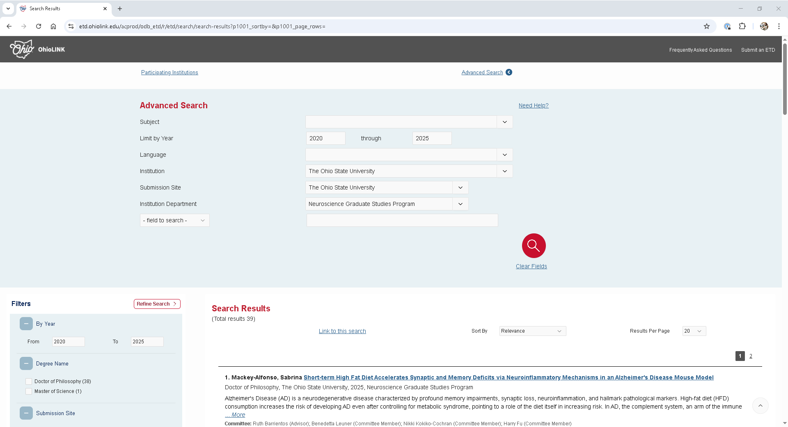

OhioLINK's [Electronic Theses and Dissertations (ETD) Center](https://etd.ohiolink.edu/acprod/odb_etd/r/etd/search/1?clear=0,1,5,10,20,21,1001) offers access to abstracts and dissertations submitted by participating OhioLINK universities and colleges. When available, full-text PDFs can also be downloaded. The platform offers basic search tools for finding documents by title, author or keywords, while the [advanced search](https://etd.ohiolink.edu/acprod/odb_etd/r/etd/search/search-results?p1001_advanced=1&clear=0,1001) allows for more refined queries by subject, year, language, institution, ORCID iD, committee members, topic keywords, and full-text. 

Prospective PhD students can use the ETD Center to explore research aligned with their interests, identify academic programs that match their goals, and discover potential advisors or committee members by reviewing recent dissertations.

## Data skills | concepts
- Web scraping
- Dynamic vs. static HTML

## Learning objectives
1. Understand the difference between dynamic and static HTML
2. Develop strategies and approaches to gather dynamic HTML content.

This tutorial assumes you already have a basic understanding of Python, including how to iterate through lists and dictionaries to extract data using a for loop. To learn basic Python concepts visit the Python - Mastering the Basics tutorial.

:::{important}Copyright | Terms of Use
Remember to examine copyright and terms of use before starting any web scraping project.

 [OhioLINK ETD Acceptable Use Policy](https://www.ohiolink.edu/content/acceptable_use_policy_ohiolink_etd). 

Limited use of copyrighted materials is allowed under certain conditions for journalism, scholarship, and teaching. [Use the Resources for determining fair use](https://library.osu.edu/copyright/fair-use) to verify your project is within the scope of fair use. Contact University Libraries [Copyright Services](https://library.osu.edu/copyright) if you have any questions.
:::


# LESSON 6
When exploring the OhioLINK [Electronic Theses and Dissertations Center](https://etd.ohiolink.edu/acprod/odb_etd/r/etd/search/1?clear=0,1,5,10,20,21,1001), you may notice that it lacks built-in options to print, email, save, or export search results to citation managers or other tool. While the [ETD Center Consumer Guide](https://www.ohiolink.edu/content/etd_center_consumer_guide) provides documentation for accessing data via an API, this method can be move complex than necessary, especially if your goal is simplty to retrieve metadata for a specific department within a defined time frame. 


:::{admonition} Exercise 1: Examine the URL
:class: sidebar note
:icon: False
:label: exercise1

Search for theses and dissertations submitted after 2020 from a specific department at The Ohio State University using the OhioLINK ETD advanced search:

Go to the OhioLINK ETD [advanced search](https://etd.ohiolink.edu/acprod/odb_etd/r/etd/search/search-results?p1001_advanced=1&clear=0,1001) interface.

1. Leave the **Subject** field blank.
2. In the **Institution** menu, select **The Ohio State University.**
3. Under **Submission Site**, select **The Ohio State University** again.
4. The **Institution Department** field will now appear, showing actual dissertation program names used by the university. This feature is especially useful for locating dissertations from interdisciplinary or uniquely named programs. Choose an **Institution Department**.
5. Examine the search URL. How is it structured? How does it differ from other URLs you've used for web scraping?

:::

:::{seealso} Solution
:class: dropdown



This search for theses and dissertations submitted after 2020 by students matriculating from The Ohio State University's Neuroscience Graduate Studies Program yields 39 records, with 20 results showing per page. The search url does not include any visible search parameters or facets, and it remains unchanged even when navigating to the second page of results.

`https://etd.ohiolink.edu/acprod/odb_etd/r/etd/search/search-results?p1001_advanced=1&clear=0,1001`

:::

The OhioLINK [Electronic Theses and Dissertations Center](https://etd.ohiolink.edu/acprod/odb_etd/r/etd/search/1?clear=0,1,5,10,20,21,1001) operates as a **dynamic website**. While the page layout - including the headers, footers, and general structure -- is built into the static HTML, the actual search results are dynamically retrieved from a server and injected into this framework. 

If you inspect the page using Developer Tools, you'll find that each search result is rendered within the `<div class="t-SearchResults-content">` element. This structure allows the OhioLINK ETD to update content without reloading the entire page.

:::{code-block}
<div class="t-SearchResults-content">
            <h3 class="t-SearchResults-title">
                1. <span class="t-SearchResults-author">Mackey-Alfonso, Sabrina</span>
                <a href="/acprod/odb_etd/r/etd/search/10?p10_accession_num=osu1744894008278402&amp;clear=10&amp;session=10473290292427">Short-term High Fat Diet Accelerates Synaptic and Memory Deficits via Neuroinflammatory Mechanisms in an Alzheimer's Disease Mouse Model</a>
            </h3>
            <div class="t-SearchResults-info">
              <p class="t-SearchResults-degree">
                  Doctor of Philosophy, The Ohio State University, 2025, Neuroscience Graduate Studies Program
              </p>
              <p class="t-SearchResults-desc hide-class"><div style="overflow: hidden; height: 40px;">Alzheimer's Disease (AD) is a neurodegenerative disease characterized by profound memory impairments, synaptic loss, neuroinflammation, and hallmark pathological markers. High-fat diet (HFD) consumption increases the risk of developing AD even after controlling for metabolic syndrome, pointing to a role of the diet itself in increasing risk. In AD, the complement system, an arm of the immune system which normally tags redundant or damaged synapses for pruning, becomes pathologically overactivated leading to tagging of healthy synapses. While the unhealthy diet to AD link is strong, the underlying mechanisms are not well understood in part due to confounding variables associated with long-term HFD which can independently influence the brain. Therefore, we experimented with a short-term diet regimen to isolate the diet's impact on brain function without causing changes in metabolic markers.
This project investigated potential mechanisms underlying cognitive impairments evoked by short-term diet consumption using the 3xTg-AD model. In chapter 1 we discuss the link between HFD and AD and outline the current findings and hypothesis regarding of relevant mechanisms. In chapter 2 we characterize the effect of short-term HFD on 1) memory, 2) neuroinflammation including complement, 3) AD pathology markers, 4) synaptic markers, and 5) in vitro microglial synaptic phagocytosis in the 3xTg-AD mouse model. In chapter 3 we analyze two potential mechanisms underlying HFD-mediated AD vulnerability: toll-like receptor 4 (TLR4)-evoked neuroinflammation and complement system activation. Finally, in chapter 4 we validate the absence of glucose modifications as an effect of the diet and drug treatment, explore potential mitochondrial mechanisms in the hippocampus, and evaluate the diet's impact on the pre-frontal cortex (PFC).
Following the consumption of either standard chow or HFD, 3xTg-AD mice exhibited impaired long-term memory performance which was associated with increased level (open full item for complete abstract)</div> <a href="#" data-ctrl="" class="">... <em>More</em></a></p>
              <span class="t-SearchResults-misc"><b>Committee:</b> Ruth Barrientos (Advisor); Benedetta Leuner (Committee Member); Nikki Kokiko-Cochran (Committee Member); Harry Fu (Committee Member)</span>
              <span class="t-SearchResults-misc"><b>Subjects:</b> Neurosciences</span>
              <!-- span class="t-SearchResults-misc">Score: 100</span -->
            </div>
        </div>
:::

If you try to scrape your search results using **requests** and **BeautifulSoup**, however, you will quickly realize that the retrieved page only includes the static HTML shell, none of the dynamically loaded search results are included. This happens because the content is rendered via JavaScript after the initial page load.

For small-scale projects, you can work around this limitation with a few simple steps.

1. Reset **Results Per Page** to **100**.
2. Right-click on results, choose **Save As**, and select **Webpage, Single File (*.mhtml)** as the format.
3. Open the saved `.mhtml` file using **Notepad** or any other plain text editor.
4. Delete any content above the line starting with the tag `<!DOCTYPE html>`
4. Save the file again, changing the extension from `.mhtml` to `.html`.

Once saved as a `.html` file, you can use `open('filepath').read()` to read the HTML file into Python with **BeautifulSoup** and parse the page. 

:::{admonition} Exercise 2: Save HTML
:class: sidebar note
:icon: False
:label: exercise2

Save your results from {ref}`exercise1` using the steps for small-scale projects listed above.

:::

:::{seealso} Solution
:class: dropdown

 selected for save as type")


:::

:::{admonition} Exercise 3: Parse HTML
:class: sidebar note
:icon: False

Parse your results from {ref}`exercise2` using **BeautifulSoup**. Gather the following elements:
- title
- author
- degree
- degre_year
- advisor
- committee_members
- subjects

Remember to use use `open('filepath').read()` to read the HTML file into Python first. Export your results to CSV.

:::

:::{seealso} Solution
:class: dropdown

```{code-block}

from bs4 import BeautifulSoup
import pandas as pd

results=pd.DataFrame(columns=['title','author','degree','degree_year','advisors','committee','subjects'])

contents = open('data/results.html').read()
soup = BeautifulSoup(contents, 'html.parser')
etds = soup.find_all(attrs={"class":'3D"t-SearchResults-content"'})

for each_etd in etds:

    row={}
    title=each_etd.find("h3").find("a").text.replace('=\n','').replace('=',' ')
    row['title']=title
    author=each_etd.find('span', {"class":'3D"t-SearchResults-author"'}).text.replace('=\n','').split('\n')[0]
    row['author']=author
    degree=each_etd.find('p', {"class":'3D"t-SearchResults-degree"'}).text.split(',')[0].strip()
    row['degree']=degree
    degree_year=each_etd.find('p', {"class":'3D"t-SearchResults-degree"'}).text.split(',')[2].strip()
    row['degree_year']=degree_year
    misc_results=author=each_etd.find_all('span', {"class":'3D"t-SearchResults-misc"'})

    advisors=[]
    committee=[]
    subjects=[]
    for misc in misc_results:
        if "Committee:" in misc.text:
            members=misc.text.replace('=\n','').replace("Committee: ","").split(';')
            for member in members:
                if "advisor" in member.lower():
                    advisors.append(member.split('(')[0].replace('=\n','').strip())
                    committee.append(member.split('(')[0].replace('=\n','').strip())
                else:
                    committee.append(member.split('(')[0].strip())

        elif "Subjects:" in misc.text:
            subjs=misc.text.replace('=\n','').replace("Subjects: ","").split(';')
            for subject in subjs:
                subjects.append(subject.strip())

                
    advisors=(';').join(advisors).rstrip(';')
    row['advisors']=advisors
    committee=(';').join(committee).rstrip(';')
    row['committee']=committee
    subjects=(';').join(subjects).rstrip(';')
    row['subjects']=subjects
    
    df_row=pd.DataFrame(row, index=[0])
    results=pd.concat([df_row, results], axis=0, ignore_index=True)
    
results.to_csv('data/npsg.csv')
```

:::

For larger projects, consider using tools such as [Requests-HTML](https://requests.readthedocs.io/projects/requests-html/en/latest/) or [Selenium](https://pypi.org/project/selenium/), which can render JavaScript to scrape dynamic content.


