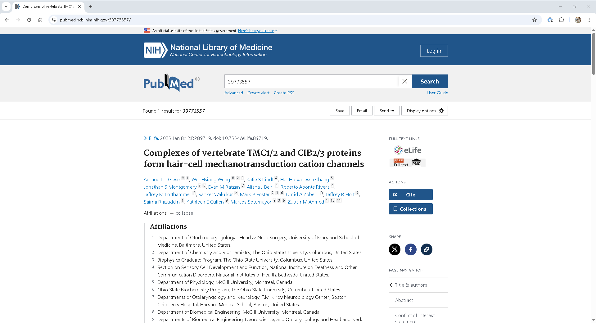
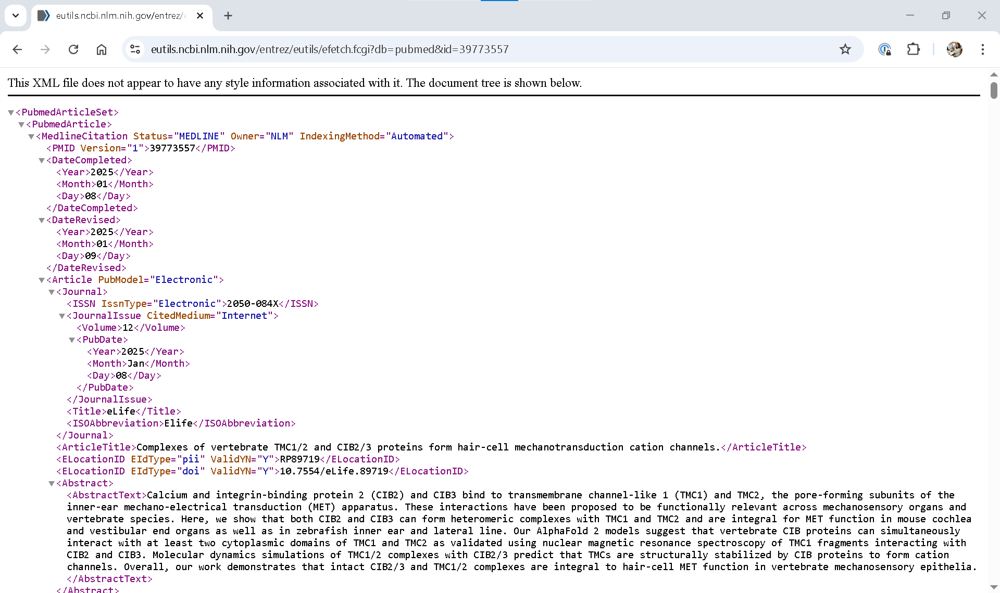
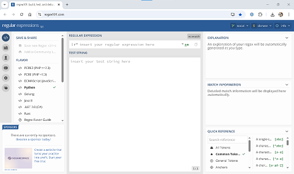

The Enztrez __[E-utilities](https://www.ncbi.nlm.nih.gov/books/NBK25500/)__ offer a suite of tools that enable researchers to automate the search and retrieval of scientific information from __[PubMed](https://pubmed.ncbi.nlm.nih.gov/)__ and other databases maintained by the National Center for Biotechnology Information (NCBI). In Lesson 4 we identified an active NIH funded research project at The Ohio State University and generated a list of PMIDs (PubMed Identifiers) associated with each project.  In Lesson 5, we will use this list of PMIDs with the Entrez __[E-utilities](https://www.ncbi.nlm.nih.gov/books/NBK25500/)__ to gather the affiliations of each author listed on the corresponding articles. We will also begin to explore regular expressions, a tool used across programming languages for matching and manipulating string data. 

## Data skills | concepts
- Working with APIs
- Manipulating text
- Regular expressions

## Learning objectives
1. Locate API documentation and identify key components required to formulate an API request
2. Parse an API response and store extracted data.
3. Utilize regular expressions to search, match, and manipulate text.

This tutorial assumes you already have a basic understanding of Python, including how to iterate through lists and dictionaries to extract data using a for loop. To learn basic Python concepts visit the Python - Mastering the Basics tutorial.

:::{tip} Tip - Copilot
\
The Enztrez __[E-utilities](https://www.ncbi.nlm.nih.gov/books/NBK25500/)__ manual can be overwhelming to read and comprehend at first. The example code is written in Perl script, not Python and the documentation assumes you are familiar working with APIs and programming tools.  Before starting this tutorial, ask Copilot to `explain entrez e-utilities`. Copilot returns a useful summary of the key components and functionalities of these tools, explains how they work, provides an example workflow, and identifies potential use cases. As you become more comfortable working with APIs, you can revisit the Enztrez __[E-utilities](https://www.ncbi.nlm.nih.gov/books/NBK25500/)__ manual to learn how to do more complex tasks.
:::


# LESSON 5
Science is constantly evolving, with new disciplines emerging from interdisciplinary research, technological advancements and more. Examining research networks can help researchers identify potential collaborators, understand rapidly evolving fields, and discover new research directions. One effective method for examining these research networks is through analyzing author affiliations listed in journal publications.

## EFetch
PubMed embeds author affiliation information in each record when this information is provided by publishers. 

:::{admonition} Exercise 1: PubMed Affiliations - HTML
:class: sidebar note
:icon: False
Search __[PubMed](https://pubmed.ncbi.nlm.nih.gov/)__ using the first PMID on the list of PMIDs you generated in Lesson 4. Take a look at the ...
- location of author affiliations 
- structure of the URL

:::

:::{seealso} Solution
:class: dropdown



:::

The __[EFetch](https://www.ncbi.nlm.nih.gov/books/NBK25499/#chapter4.EFetch)__ utility retrieves detailed records for a list of unique identifiers from an Entrez database. Entrez EFetch requests are constructed with the base_url, followed by required and optional parameters. To gather author affiliations, we will need:
- **base url** `https://eutils.ncbi.nlm.nih.gov/entrez/eutils/efetch.fcgi` 
- **database name** `?db=pubmed`
- **unique identifier** `&id=39773557`
- **api key**  `&api_key=INSERT YOUR API KEY HERE`

Required parameters depend on the [database]((https://www.ncbi.nlm.nih.gov/books/NBK25497/table/chapter2.T._entrez_unique_identifiers_ui/?report=objectonly)__) selected for your search. The default EFetch response for PubMed is XML data. NCBI requires an __[API key](https://www.ncbi.nlm.nih.gov/books/NBK25497/)__ from any IP address posting more than 3 requests per second to the E-utilities. With an API key, a IP address can post up to 10 requests per second by defaultWhile it is possible to look at one XML record in your browser without an api_key, to complete the exercises in this tutorial, you will need to obtain an API key from the Settings page in your __[NCBI account](https://www.ncbi.nlm.nih.gov/account/)__.

:::{admonition} Exercise 2: PubMed Affiliations - XML
:class: sidebar note
:icon: False
Use EFetch to retrieve the XML for the first PMID on the list of PMIDs you generated in Lesson 4.

:::

:::{seealso} Solution
:class: dropdown
 __[https://eutils.ncbi.nlm.nih.gov/entrez/eutils/efetch.fcgi?db=pubmed&id=39773557](https://eutils.ncbi.nlm.nih.gov/entrez/eutils/efetch.fcgi?db=pubmed&id=39773557)__ 



:::

If affiliations are present, they are listed under each `<Author>` tag under `<AffiliationInfo> <Affiliation>`. Use __[requests](https://requests.readthedocs.io/en/latest/)__, pandas, and __[BeautifulSoup](https://beautiful-soup-4.readthedocs.io/en/latest/)__ to gather, extract, and store information retrieved with EFetch.

:::{admonition} Exercise 3: Write and test code
:class: sidebar note
:icon: False
:label: exercise3
Using the list of PMIDs you generated in Lesson 4, write and test a Python script that gathers affiliations for each author listed on each article. Consider how to handle records with no author affiliations.

:::

:::{seealso} Solution
:class: dropdown

```{code-block}
import requests
from bs4 import BeautifulSoup as bs
import pandas as pd
import time
from datetime import date

#1. Create a last_updated variable with today's date.
today = date.today()
last_updated=today

#2. Create list of PMIDs
pmids=['39773557', '39656677', '37398045', '39229161', '39713331', '39315813', '38338688', '36721057', '37322069']

#3.Create a dataframe to store the search results. 
author_affiliations=pd.DataFrame(columns=["pmid","name","affiliation","last_updated"])

#4. Use requests, BeautifulSoup, and the EFetch utility to retrieve author affiliations.
# Store results in a DataFrame.
count=0
for each_record in pmids:
    # try:
    count += 1
    print('starting record '+str(count)+': '+str(each_record))
    search_url="https://eutils.ncbi.nlm.nih.gov/entrez/eutils/efetch.fcgi?db=pubmed&id="+str(each_record)+"&api_key=INSERT YOUR API KEY HERE"
    xml_data=requests.get(search_url).text
    soup = bs(xml_data, 'xml')
    records=soup.find('PubmedArticle')
    pmid=records.PMID.text
    authors=records.find_all("Author")
    for each_author in authors:
        if each_author.LastName != None:
            lastname=each_author.LastName.text
        else:
            lastname=''
        if each_author.ForeName != None:
            forename=each_author.ForeName.text
        else:
            forename=''
        if lastname != '' and forename != '':
            name=lastname+', '+forename
        else:
            name=''
        

        if each_author.Affiliation != None:
            affiliation=each_author.Affiliation.text
        else:
            affiliation=''
        print(f"{name}, {affiliation}")
                
        row={
            "pmid": pmid,
            "name": name,
            "affiliation": affiliation,
            "last_updated": last_updated

            }
        author_info=pd.DataFrame(row, index=[0])
        author_affiliations = pd.concat([author_info,author_affiliations], axis=0)
        time.sleep(0.15)
        
#5. Export results to csv        
author_affiliations.to_csv('data/pubmed_author_affiliations.csv')
```

:::

## Regular Expressions (regex)
Analyzing author and affiliation data presents several challenges. No standardized naming conventions for authors exist among publishers, and the structure of institutional affiliations varies widely. Challenges differenting researchers with similar names persist, and variations in name formats for both individuals and organizations complicate identification. Regular expressions offer one approach for normalizing messy, textual data.

:::{tip} Tip - ORCID
 __[Create your ORCID iD](https://orcid.org/register)__ to help researchers distinguish your work from others and better track the impact of your work. 

PubMed now embeds the ORCID in `<Author>` tags. Several journals and funding agencies also now require ORCID iDs for submissions. See __[Tracking and Enhacing the Impact of your Research](https://guides.osu.edu/c.php?g=608754&p=4233669)__ for more information.

:::


Regular expressions match patterns in text.  Often described as wildcards on steroids, regular expressions can:
- **Validate:** Ensure text input matches matches a specific pattern, such as a 5 digit zip code (^\d{5}$).
- **Extract:** Pull out specific text from a document, like all spelling variations of the word "color"(colou?r) or "hematology" (ha?ematology).
- **Replace:** Find and replace text, such as changing all instances of 'OH' to 'Ohio' (re.sub(r'\bOH\b', 'Ohio', content)).

Regular expressions are included in several programming langauges and software programs including Python, JavaScript, and Tableau. 

- [A-Z] matches any one uppercase letter.
- [a-z] matches any one lowercase letter.
- [0-9] matches any one digit.
- [0-9]{5} matches a pattern of 5 digits.


__[Metacharacters](https://www.w3schools.com/python/gloss_python_regex_metacharacters.asp)__ have special meaning in Regular Expressions and must be escaped with a `\`. Metacharacters include:
- `[ ]` A set of characters, e.g., `[a-f]`.
- `\` Start of a special sequence, e.g., `\w`.
- `.` Any character except newline, e.g., `d.g`.
- `^` Starts with, e.g., `^Ohio`.
- `$` End with, e.g., `State$`.
- `*` Zero or more characters, e.g., `h*matology`.
- `+` One or more characters, e.g., `spe+s`.
- `?` Zero or more characters, e.g., `p?ediatric`.
- `{ }` Exactly x number of characters, e.g., `[0-9]{5}`.
- `|` or, e.g. `Ohio State|OSU`.
- `( )` Extract or group.

### LEARNING RESOURCES
::::{grid} 1 1 2 3

:::{card}
:header: regex101

:::
:::{card}
:header: Learning Rgular Expressions

+++
__[Learning Regular Expressions](https://library.ohio-state.edu/record=b9497158~S7)__
by Ben Forta, 2018.   
:::
::::

###  - regex101
 __[regex101:build,test,debug](https://regex101.com/)__ helps you write regular expressions for multiple programming languages. This tool also allows you to test your regular expression against a sample string of your data, explains your regex as you type, and offers a searchable quick reference of regex syntax.

### - Learning Regular Expressions
 The ebook __[Learning Regular Expressions](https://library.ohio-state.edu/record=b9497158~S7)__ by Ben Forta is available through the Libraries [Safari Books](https://library.ohio-state.edu/record=e1002334T~S7) package of technical books and videos. Each chapter is organized as a lesson that teaches you how to match a single character or set of characters, utlize metacharacters and more.

## re module
To use regular expressions in Python, import the __[re](https://docs.python.org/3/library/re.html)__ module.

`import re`

Useful re methods include:

### [re.match( )](https://docs.python.org/3/library/re.html#re.match)
`re.match(pattern, string, flags=0)`

True if zero or more characters at the **beginning** of the string match the regular expression pattern.

:::{code-cell}
import pandas as pd
import re

addresses=pd.read_csv('data/pubmed_author_affiliations.csv')
addresses=addresses.dropna(subset='affiliation') #drops rows with null affiliation values

for idx, row in addresses.iloc[0:10].iterrows():
    affiliation=str(row.affiliation)
    print(affiliation)
    osu_match=re.match(r"Ohio State University",affiliation) 
    if osu_match:
        print(f" MATCH {osu_match.group()}: {affiliation}")

:::

### [re.search( )](https://docs.python.org/3/library/re.html#re.search)
`re.search(pattern, string, flags=0)`

Searches through string and finds the first location where the string matches the regular expression pattern

:::{code-cell}
import pandas as pd
import re

addresses=pd.read_csv('data/pubmed_author_affiliations.csv')
addresses=addresses.dropna(subset='affiliation')

for idx, row in addresses.iloc[0:10].iterrows():
    affiliation=str(row.affiliation)
    # print(affiliation)
    osu_search=re.search(r"The Ohio State University",affiliation) 
    if osu_search:
        print(osu_search.group())
    else:
        print(f"No match: affiliation = {affiliation}")
:::

### [re.findall( )](https://docs.python.org/3/library/re.html#re.findall)
`re.findall(pattern, string, flags=0)`

Scans string from left to right and returns all matches in the string as a list of strings or tuples.

:::{code-cell}
# HOW MANY TORTOISES AND TURTLES ARE IN THIS LIST OF ANIMALS?

import pandas as pd
import re

df=pd.read_csv('data/animals_tortoises.csv')
animals=df.common_name.tolist()
animals=','.join(animals)
print('LIST OF ANIMALS')
print(animals)

tortoises_turtles=re.findall(r"tortoise|turtle", animals)
print('ANSWER')
print(f"There are {len(tortoises_turtles)} tortoises and turtles in this list of animals.")
:::

### [re.sub( )](https://docs.python.org/3/library/re.html#re.sub)
`re.sub(pattern, repl, string, count=0, flags=0)`

Finds the string pattern and replaces it with the text provided.

:::{code-cell}

# FIND TORTOISES AT THE NATIONAL ZOO AND REPLACE THE COMMON_NAME WITH "SLOW TORTOISE"
import pandas as pd
import re

df=pd.read_csv('data/animals_tortoises.csv')
animals=df.common_name.tolist()
animals=','.join(animals)
pattern="tortoise|turtle"
tortoises_slow=re.sub(pattern,"SLOW TORTOISE,",animals)
tortoises_slow

:::

:::{admonition} Exercise 4: Use re to normalize affiliations
:icon: False
Use regular expressions to create a list of institution names from the affiliations list you generated in {ref}`exercise3`.

:::

:::{seealso} Solution
:class: dropdown
```{code-block}
import requests
from bs4 import BeautifulSoup as bs
import pandas as pd
import time
from datetime import date
import re

#1. Create a last_updated variable with today's date.
today = date.today()
last_updated=today

#2. Create list of PMIDs
pmids=['39773557', '39656677', '37398045', '39229161', '39713331', '39315813', '38338688', '36721057', '37322069']

#3.Create a dataframe to store the search results. 
author_affiliations=pd.DataFrame(columns=["pmid","name","affiliation","institution","last_updated"])

#4. Use requests, BeautifulSoup, and the EFetch utility to retrieve author affiliations.
# Store results in a DataFrame.
count=0
for each_record in pmids:
    # try:
    count += 1
    print('starting record '+str(count)+': '+str(each_record))
    search_url="https://eutils.ncbi.nlm.nih.gov/entrez/eutils/efetch.fcgi?db=pubmed&id="+str(each_record)+"&api_key=INSERT API KEY HERE"
    xml_data=requests.get(search_url).text
    soup = bs(xml_data, 'xml')
    records=soup.find('PubmedArticle')
    pmid=records.PMID.text
    authors=records.find_all("Author")
    for each_author in authors:
        if each_author.LastName != None:
            lastname=each_author.LastName.text
        else:
            lastname=''
        if each_author.ForeName != None:
            forename=each_author.ForeName.text
        else:
            forename=''
        if lastname != '' and forename != '':
            name=lastname+', '+forename
        else:
            name=''
        

        if each_author.Affiliation != None:
            affiliation=each_author.Affiliation.text

            ohio_state=re.search(r"Ohio State", affiliation)
            harvard_medical_school=re.search(r"Harvard Medical School", affiliation)
            institut_genetique=re.search(r"Institut de Génétique et de Biologie Moléculaire et Cellulaire", affiliation)
            johns_hopkins=re.search(r"Johns Hopkins University", affiliation)
            mcgill=re.search(r"McGill University", affiliation)
            nci=re.search(r"National Cancer Institute", affiliation)
            nidcd=re.search(r"National Institute on Deafness and Other Communication Disorders", affiliation)
            northeastern=re.search(r"Northeastern University", affiliation)
            u_bristol=re.search(r"University of Bristol", affiliation)
            u_maryland=re.search(r"University of Maryland", affiliation)
            u_virginia=re.search(r"University of Virginia", affiliation)
            vicosa=re.search(r"Universidade Federal de Viçosa", affiliation)
            if ohio_state:
                institution="The Ohio State University"
            elif harvard_medical_school:
                institution=harvard_medical_school.group()
            elif institut_genetique:
                institution=institut_genetique.group()
            elif johns_hopkins:
                institution=johns_hopkins.group()
            elif mcgill:
                institution=mcgill.group()
            elif nci:
                institution=nci.group()
            elif nidcd:
                institution=nidcd.group()
            elif northeastern:
                institution=northeastern.group()
            elif u_bristol:
                institution=u_bristol.group()
            elif u_maryland:
                institution=u_maryland.group()
            elif u_virginia:
                institution=u_virginia.group()
            elif vicosa:
                institution=vicosa.group()

        else:
            affiliation=''
        print(f"{name}, {affiliation}")

        row={
            "pmid": pmid,
            "name": name,
            "affiliation": affiliation,
            "institution": institution,
            "last_updated": last_updated

            }
        author_info=pd.DataFrame(row, index=[0])
        author_affiliations = pd.concat([author_info,author_affiliations], axis=0)
        time.sleep(0.15)
        
#5. Export results to csv        
author_affiliations.to_csv('pubmed_author_affiliations.csv')
```


:::


