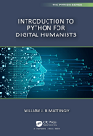
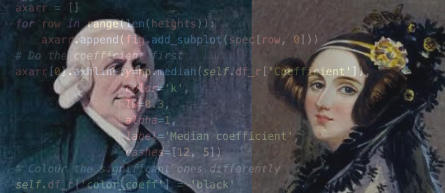
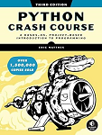
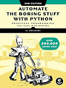
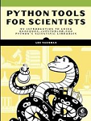

__[Python](https://www.python.org/)__ is a free general purpose programming language used in several academic fields and throughout industry. Python offers several packages or libraries that support data gathering, data cleaning, and data visualization, such as matplotlib, plotly, pandas, BeautifulSoup, and more. 
<!-- 
## Examples

__[The Python Graph Gallery](https://python-graph-gallery.com/)__  
__[Seaborn Gallery](https://seaborn.pydata.org/examples/index.html)__ -->

## Free Resources

These freely accessible, discipline-specific open-access textbooks come with highly sought-after Jupyter notebooks. You can download or clone these notebooks to practice the concepts introduced, using either the provided demo data or your own datasets.

::::{grid} 1 1 2 3

:::{card}
:header: Introduction to Cultural Analytics & Python

+++
__[Introduction to Cultural Analytics & Python](https://melaniewalsh.github.io/Intro-Cultural-Analytics/welcome.html)__   
by Melanie Walsh, 2024.   
Winner of "Best DH Training Material" 2021. 
:::

:::{card}
:header: Intro to Python for Digital Humanists
  
+++
__[Introduction to Python for Digital Humanists](https://github.com/wjbmattingly/python_for_dh)__  
by William J.B. Mattingly   
Boca Raton : CRC Press, 2023.  
 
:::

:::{card}
:header: Coding for Economists
  
+++
__[Coding for Economists](https://aeturrell.github.io/coding-for-economists/intro.html#)__  
by Arthur Turrell, 2023   
 
:::

::::

## Books

::::{grid} 1 1 2 3

:::{card}
:header: Python Crash Course
  
+++
Get up and running in a weekend with Eric Matthes' __[Python crash course : a hands-on, project-based introduction to programming, 3rd edition](https://library-ohio-state-edu.proxy.lib.ohio-state.edu/record=b10717418~S7)__. Using approachable language paired with coding examples, this book introduces Python variables, data types, methods, functions, and more while pushing you to try each introduced concept yourself. 
:::

:::{card}
:header: Automate the Boring Stuff
  
+++
Learn Python basics and then master using Python to scrape websites, match text patterns using regular expressions, read documents, work with .csv and .json data, schedule tasks, manipulate images, and more with Al Sweigart's __[Automate the boring stuff with Python : practical programming for total beginners, 2nd edition](https://library.ohio-state.edu.proxy.lib.ohio-state.edu/record=b9501689~S7)__  Each chapter includes practice questions, helping you to apply what you've learned and become a more confident programmer.
:::

:::{card}
:header: Python Tools for Scientists
  
+++
__[Python tools for scientists : an introduction to using Anaconda, Jupyterlab, and Python's scientific libraries](https://library.ohio-state.edu/record=b10328916~S7)__  
by Lee Vaughan  
San Francisco : No Starch Press, 2023.
:::

::::

## Recommended Python Libraries
### Standard Library Modules
- __[os](https://docs.python.org/3/library/os.html#module-os)__  
 Tell Python where to find and save files
- __[glob](https://docs.python.org/3/library/glob.html#module-glob)__  
Find file/pathnames with a directory wildcard search. Glob provides a means to iterate through a file directory's content.
- __[re](https://docs.python.org/3/library/re.html#module-re)__  
Known as wildcards on steroids, Regular Expressions match patterns in text, allowing you to search for and extract terms from a document. 
- __[urllib.request](https://docs.python.org/3/library/urllib.request.html)__    
Library for opening urls

### Essential Library Modules
- __[requests](https://requests.readthedocs.io/en/latest/)__
The [requests](https://requests.readthedocs.io/en/latest/) library retrieves HTML or XML documents from a server and processes the response. 
- __[numpy](https://numpy.org/)__  
Essential package for scientific computing. A standard for working with numerical data.
- __[pandas](https://pandas.pydata.org/)__  
A common Python library used to open and read datasets, organize, clean and transform data, and prepare data for analysis and visualization.
- __[matplotlib](https://matplotlib.org/)__  
A "comprehensive library for creating static, animated, and interactive visualizations in Python."

### Other Library Modules

- __[seaborn](https://seaborn.pydata.org/)__  
A library based on matplotlib and used to format and create nmore attractive visualizations. 

## Tutorials
University Libraries hosts a number of data skills [workshops and events](https://library.osu.edu/events?tid=921) for Ohio State faculty, students and staff throughout the academic year. Tutorials are also available in the menu on the bottom left side of this webpage.