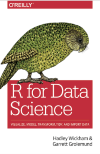

R is a free, open-source statistical programming language that is popular in several academic fields. R offers several packages supporting data cleaning and data visualization, inclugin ggplot and plotly. 

## Install R
1. Download and install the __[R](https://cran.case.edu/)__ programming language.
2. Download and install __[R Studio](https://posit.co)__
3. Download and install __[Tidyverse packages](https://www.tidyverse.org/packages/)__

## Websites
* __[R Studio Education](https://education.rstudio.com/)__
* __[Getting Help with R](https://www.r-project.org/help.html)__

## Books

::::{grid} 1 1 

:::{card}
header: R for Data Science
  
+++
__[R for Data Science](https://library-ohio-state-edu.proxy.lib.ohio-state.edu/record=b9493427~S7)__    
by Hadley Wickham, Garrett Grolemund  
Sebastopol, CA : O'Reilly Media, 2016.
:::

::::

